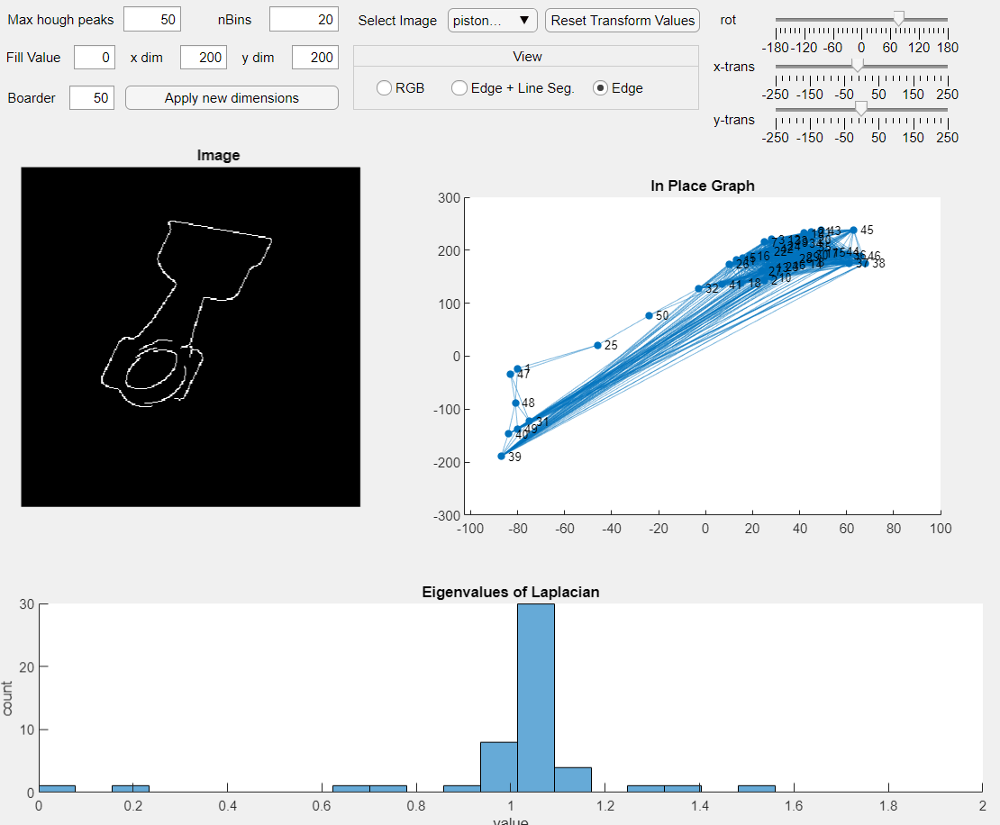

# SpectralGraphRecognition
Data Structures and Algorithms Project: Classification of Objects using Graph SpectraEmbeddings derived from Hough Space

## Abstract

We propose an algorithm to quickly and accurately classify edge-detected images of isolated objects. This is motivated by the general problem of matching objects observed by cameras to corresponding 3D models' wire-frame renderings. Our algorithm uses a low-dimensional embedding of the edge-detected image that is a histogram-representation of the spectra of the graph created using the relationship of peaks in the image's Hough transformation. We narrow the problem scope to matching edge-detected images to rotated and translated instances of themselves, and see success rates of up to 90\% in classification. We employ both linear search and simulated annealing optimization methods and compare their results.

## Results
The performance of our algorithm - along with a complete description of our implementation process and method - can be found in our [project writeup](project_writeup.pdf)

## Usage

Using MATLAB, run the `main.m` script to generate the training and test data from the source images in the `data/` directory, perform the pre-processing, and generate confusion matrices for both simulated annealing and linear search.

An interactive app, `houghViz.mlapp`, allows you to visualize the preprocessing stages of the algorithm in real time.

### Example

Depicted is a screen capture of the interactive app we made to visualize the edge detection, graph embedding, and graph spectra components of our algorithm in the top left, top right, and bottom halves of the window respectively. The controls at the top right allow the user to transform the source image in real time, with the controls on the top left controlling the size and background values of the resulting image as well as the parameters for making the histogram.
